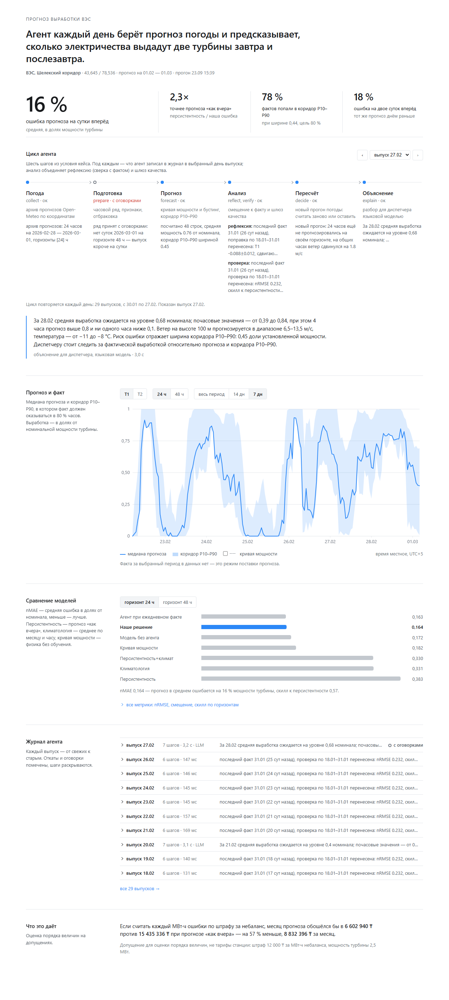

# Прогноз выработки ВЭС: агентная система

Почасовой прогноз выработки двух ветротурбин на 24–48 часов вперёд. Система сама забирает прогноз
погоды по координатам площадки, готовит признаки, считает выработку, проверяет себя против базовых
линий и объясняет результат. Тестовый период — февраль 2026.

Главное требование кейса соблюдено буквально: прогноз на каждый час февраля построен на **том
прогнозе погоды, который был доступен за 24 и 48 часов до этого часа**, а не на фактической погоде.

Площадка: ВЭС в Шелекском коридоре, Алматинская область, 43.645150 / 78.535604.

## Запуск

```bash
pip install -r requirements.txt
python -m windagent.run --backtest
```

Одна команда делает всё: собирает часовые данные турбин, снимает кривые мощности, обучает модель,
проверяет агентный цикл на отложенном окне и прокручивает его по графику из условия — выпуски
30 и 31 января, 1 февраля и далее каждый день до 27 февраля, каждый на следующие 24–48 часов.
Прогноз на февраль — это ровно то, что выпустил агент в эти дни.

Что появится:

| Путь | Что внутри |
| --- | --- |
| `forecasts/2026-02/forecast_T1.csv`, `forecast_T2.csv` | прогноз агента: 672 часа × 2 горизонта на турбину |
| `forecasts/metrics.csv` | метрики по моделям, горизонтам и режимам |
| `out/agent_log.json` | журнал агента: каждый шаг каждого выпуска |
| `web/data.json`, `web/data.js` | данные для дашборда |

Колонки прогноза:

| Колонка | Смысл |
| --- | --- |
| `issue_time` | момент выпуска прогноза, UTC |
| `time` | час, на который прогноз, UTC |
| `time_local` | тот же час по времени Алматы (UTC+5) — как в данных организаторов |
| `lead_h` | горизонт: 24 — прогноз на следующие сутки, 48 — на послезавтра |
| `p50` | прогноз выработки, доля от номинала |
| `p10`, `p90` | коридор: с вероятностью 80 % факт внутри |

Дашборд — `web/index.html`, открывается двойным кликом, интернет не нужен.



Ещё два режима:

```bash
python -m windagent.run --forecast   # живой выпуск на ближайшие 24–48 часов по свежей погоде (нужна сеть)
python -m windagent.run --export     # пересобрать web/data.json без выгрузок в forecasts/
```

Время полного прогона: около минуты на ноутбуке (обучение, валидация модели и агентного цикла на
93 выпусках, прокрутка февраля на 29 выпусках, все выгрузки). Модель — HistGradientBoosting из
scikit-learn, считает на CPU.

### Языковая модель

Объяснение для диспетчера пишет языковая модель. Ключ кладётся в файл `.env` в корне (он в
`.gitignore`):

```
OPENAI_API_KEY=sk-...
# LLM_PROVIDER=nvidia и NVIDIA_API_KEY=nvapi-... — NVIDIA NIM
# LLM_MODEL=gpt-6-sol — другая модель
```

По умолчанию — `gpt-6-luna`. **Без ключа система работает полностью**: прогноз, проверки и журнал
не зависят от языковой модели, объяснение собирается шаблоном из тех же чисел (статус «шаблон» в
журнале). Проверить ключ: `python checks/llm_ping.py`.

## Архитектура

```
                   ┌──────────────────────────────────────────────┐
                   │                  АГЕНТ                       │
                   │  цикл с журналом: каждый шаг пишется в лог   │
                   └──────────────────────────────────────────────┘
                                      │
   ┌──────────────┐   ┌───────────────▼────────────┐   ┌────────────────────┐
   │ 1. Погода    │──▶│ 2. Подготовка данных       │──▶│ 3. Расчёт прогноза │
   │ Open-Meteo   │   │ часовая сетка, признаки,   │   │ кривая мощности +  │
   │ Previous Runs│   │ отбраковка простоев        │   │ бустинг, P10/50/90 │
   └──────────────┘   └────────────────────────────┘   └─────────┬──────────┘
          ▲                                                      │
          │ пересчёт при новом прогоне погоды                    ▼
   ┌──────┴───────────┐   ┌──────────────────────┐   ┌────────────────────────┐
   │ 5. Решение       │◀──│ 4. Шлюз качества     │◀──│ базовые линии          │
   │ объяснение,      │   │ хуже базовой линии — │   │ климатология,          │
   │ когда считать    │   │ откат на неё         │   │ персистентность, кривая│
   └──────────────────┘   └──────────────────────┘   └────────────────────────┘
```

Где что считается:

- **Числа считает код.** Кривая мощности, бустинг, метрики, интервалы — обычный Python, без языковой
  модели. Это принципиально: прогноз выработки не должен зависеть от того, что «подумала» LLM.
- **Языковая модель объясняет.** Читает готовые цифры и пишет разбор для диспетчера: что ждёт
  станцию, где риск ошибки. Ни одна цифра прогноза от неё не зависит.
- **Решение о пересчёте.** Когда выходит новый прогон погоды, агент сравнивает его с прошлым на
  перекрывающихся часах: если ветер сдвинулся меньше чем на 1 м/с, оставляет прежний прогноз и пишет
  «пересчёт не нужен», иначе считает заново.
- **Рефлексия.** Перед публикацией агент сверяет свою медиану с фактом последних 14 суток и снимает
  систематическое смещение, если оно больше двух стандартных ошибок.
- **Шлюз качества стоит между расчётом и публикацией.** Если на последних 14 днях с фактом решение
  проигрывает прогнозу «как вчера», агент публикует чистую кривую мощности и пишет откат в журнал.
- **Отказы не валят цикл.** Нет сети или данных — запись `error` в журнале и понятная причина.

Провайдер языковой модели переключается переменной окружения: OpenAI или NVIDIA NIM
(`https://integrate.api.nvidia.com/v1`, тот же клиент, меняется адрес и ключ).

## Данные

| Источник | Что берём |
| --- | --- |
| CSV турбин (даны организаторами) | скорость ветра, нормализованная мощность, температура; шаг 10 минут, 11.03.2023 — 31.01.2026 |
| Open-Meteo Previous Runs API | архивные прогнозы: ветер и направление на 100 м, ветер на 10 м, температура, давление |

Обработка данных турбин:

- часовое усреднение с подсчётом числа замеров в часе — неполные часы в обучение не идут;
- **метки времени в файлах местные, а не UTC.** Сдвиг определён по взаимной корреляции измеренного
  ветра с прогнозным: 6 часов до перехода Казахстана на единый пояс и 5 после. Без этой поправки
  прогноз и факт разъезжаются на несколько часов, и любая метрика теряет смысл;
- **«ноль» в данных записан как 0.01**, мощность квантована до сотых — приводим к настоящему нулю;
- **часы простоя** (мощность ≈ 0 при рабочем ветре, около 1,5 % времени, серии до 47 часов) помечены
  отдельно: это ограничения выдачи, а не физика. В обучение они не идут и в основную метрику тоже,
  но показаны отдельной строкой — прятать их было бы нечестно.

Базовая погодная модель названа явно — ICON (`icon_seamless`). Запрос без модели («best match»)
отдаёт Open-Meteo на выбор, и 1 октября 2025 он сам переключился с ICON на другую модель: обучение
шло бы на одной, февраль — на другой.

Архив прогнозов погоды — базовый и три члена ансамбля — лежит в репозитории (`data/weather/*.parquet`,
около 2 МБ), поэтому прогон воспроизводится без интернета.

Турбины стоят в 338 м друг от друга и попадают в одну ячейку любой погодной сетки, поэтому погода
запрашивается один раз, а различия между машинами модель ловит признаком турбины.

## Почему не historical-forecast-api

Очевидный кандидат на «архив прогнозов» у Open-Meteo — `historical-forecast-api`. Для этого кейса он
не годится, и это главная ловушка задания.

Этот эндпоинт склеивает непрерывный ряд из **первых часов каждого прогона** (горизонт 0–3 часа). То
есть каждое значение там — это почти факт: прогноз, выпущенный час-два назад, знает текущую погоду.
Модель, обученная на таком входе, показывает отличные метрики на валидации и разваливается, когда ей
дают настоящий прогноз на сутки вперёд, — а именно так её и будут использовать.

Мы берём **Previous Runs API**: колонки `wind_speed_100m_previous_day1` и `_previous_day2` — это
буквально то, что предсказывали за 24 и за 48 часов до целевого времени, со всеми ошибками прогноза.
Горизонт хранится в таблице как признак `lead_h`, и модель учится отдельно понимать, насколько
прогноз на двое суток хуже суточного.

Цена вопроса измерена: тот же пайплайн на ноукасте против честного архива — строка «цена утечки» в
выводе валидации. Разница показывает, насколько завышенными были бы метрики при подмене источника.

## Модель и метрики

Четыре слоя:

0. **Ансамбль погодных моделей** — к базовому ICON добавлены среднее и разброс по ICON, GFS и ECMWF,
   каждая со своими прогнозами за 24 и 48 ч. Среднее по трём ближе к измеренному ветру, чем любая одна,
   а разброс между ними — готовая мера неопределённости часа: там, где модели спорят, коридор шире.
   Сглаживание ветра по соседним часам считается внутри блока выпуска — один горизонт, одни сутки, —
   то есть ровно по тому, что агент видит в день выпуска.
1. **Кривая мощности** — эмпирическая, по бинам прогнозной скорости, отдельно для каждой турбины и
   каждого горизонта. Строится на прогнозной, а не измеренной скорости: прогноз сглажен относительно
   показаний анемометра, и кривая, снятая с измерений, дала бы систематическое смещение.
2. **Градиентный бустинг на остаток** — учит то, что физика не объясняет: систематические ошибки
   прогноза погоды, плотность воздуха, направление, сезон, час. Отдельные квантильные модели дают
   коридор P10–P90, поверх — конформная калибровка на отложенном срезе, чтобы покрытие соответствовало
   заявленному.
3. **Рефлексия агента** — перед публикацией агент сверяет свою медиану с фактом последних 14 суток по
   каждой турбине и снимает смещение, если оно больше двух стандартных ошибок, то есть отличимо от
   шума; иначе пишет в журнал «в пределах шума, поправка не нужна». Сдвигается только медиана внутри
   коридора — сдвиг всего коридора ронял покрытие, потому что пятая часть фактов ровно ноль. Зимой
   модель систематически завышает (смещение около −0,08), и рефлексия это ловит: строка «наше
   решение» против «модели без агента» в таблице ниже, замер — `checks/reflect_eval.py`.

Валидация — отложенное окно **ноябрь 2025 — январь 2026**: модель этих данных не видела, а зима —
тот же режим, что и в феврале. Февраль 2026 проверить нечем: в выданных данных его нет, это режим
поставки, а не теста.

«Наше решение» измерено тем же агентным циклом, который выпускает февраль, и в том же режиме: факт
обрывается в начале каждого месяца валидации, как в феврале он кончается 31 января, и агент переносит
поправку смещения по последним 14 суткам известного факта (если ему не больше 30 суток). Замер
`checks/stale_reflect.py`: перенос поправки 0,164 против 0,172 без неё; при ежедневном факте — 0,163. Рядом — та же модель без агента и лестница
базовых линий: климатология по месяцу и часу, персистентность («как сутки назад»), их смесь и чистая
кривая мощности без обучения. Часы без простоев.

| Модель | nMAE 24 ч | nMAE 48 ч | Скилл 24 ч | Скилл 48 ч |
| --- | --- | --- | --- | --- |
| **Наше решение (агентный цикл, режим поставки)** | **0,164** | **0,179** | **0,57** | **0,53** |
| Агент при ежедневном факте | 0,163 | 0,178 | 0,58 | 0,54 |
| Модель без агента | 0,172 | 0,187 | 0,55 | 0,52 |
| Кривая мощности | 0,182 | 0,197 | 0,52 | 0,49 |
| Персистентность + климатология | 0,330 | 0,331 | 0,14 | 0,14 |
| Климатология | 0,331 | 0,331 | 0,14 | 0,14 |
| Персистентность | 0,383 | 0,385 | 0 | 0 |

nMAE — средняя ошибка в долях номинала: 0,163 значит, что прогноз в среднем ошибается на 16 %
мощности турбины. Скилл — насколько ошибка меньше, чем у прогноза «как вчера»: 0,58 — на 58 %.

Покрытие коридора P10–P90: **78 %** при средней ширине 0,45 (по определению должно быть 80 %).
Достигается конформной калибровкой: квантильные модели учатся без прошлой зимы (ноябрь 2024 —
февраль 2025), а на ней оценивается конформный отступ — отдельно на пару «турбина × горизонт»,
потому что у 48 ч разброс шире. Окно выбрано правилом «тот же сезон год назад»; для честности —
покрытие при соседних окнах: октябрь 2025 — 76 %, ноябрь–январь — 77 %, декабрь–февраль — 79 %
(`checks/calib_windows.py`).

Цена утечки: тот же пайплайн на ноукасте дал бы nMAE 0,151 против честных 0,173 — на 13 % лучше.
Именно настолько завышены метрики у решений на `historical-forecast-api`.

### Как мы поймали утечку у себя

Прежняя версия показывала nMAE 0,156. Независимое ревью нашло, что сглаживание ветра по соседним
часам считалось по строкам таблицы, где соседями одного часа были горизонты 0, 24 и 48 — и в признак
для суточного прогноза подмешивался ноукаст. Теперь окна считаются внутри блока выпуска одной функцией
для обучения и для агента, и признаки поставки совпадают с обучающими до нуля
(`checks/agent_cycle.py`). Цифры выше — честные, после исправления.

Метрики нормированы на установленную мощность, поэтому читаются как доля от номинала.

## Требования кейса и где они выполнены

| Требование | Где | Как проверить |
| --- | --- | --- |
| Модель прогноза по историческим данным | `windagent/model.py` | `python -m windagent.run --backtest`, таблица метрик |
| Прогноз погоды получается самостоятельно по координатам | `windagent/weather.py` | `python -m windagent.run --forecast` — живой запрос |
| Почасовой прогноз на 24–48 часов | `windagent/model.py`, признак `lead_h` | `forecasts/2026-02/forecast_T1.csv` |
| Полный агентный цикл с пересчётом | `windagent/agent.py` | журнал шагов на дашборде и в `out/agent_log.json` |
| Прогноз воспроизведён «как в прошлом», день за днём | `windagent/agent.py`, `rollout` | колонка `issue_time` в `forecast_T*.csv`: выпуски 30.01 — 27.02 |
| Только архивные прогнозы, не фактическая погода | `windagent/weather.py` | раздел «Почему не historical-forecast-api» |

## Ограничения

- **Февраль 2026 проверить нечем.** В выданных данных его нет, поэтому качество на нём заявлять
  нельзя — мы показываем метрики на отложенном окне и явно об этом пишем.
- Часы ограничения выдачи исключены из основной метрики: предсказать решение диспетчера по погоде
  невозможно, но их доля и влияние показаны отдельно.
- Прогноз даётся в долях от номинала, как в исходных данных. Экономический блок на дашборде —
  оценка порядка величин на **допущениях**: мощность турбины 2,5 МВт и штраф за небаланс
  12 000 ₸/МВт·ч — не тарифы станции.
- Покрытие коридора 78 % — чуть ниже заявленных 80 %: зимний ветер порывистее, чем в окне калибровки.
- Одна площадка и одна ячейка погодной сетки: на парк из десятков турбин решение переносится, но
  потребует учёта затенения между машинами.
- Горизонт ограничен глубиной архива Previous Runs — с 17.02.2024.

## Что дальше

- Сезонная поправка вместо скользящей: смещение зимой устойчиво отрицательное (≈ −0,08), его можно
  учить признаком, а не ловить рефлексией.
- Учёт затенения между турбинами по направлению ветра — на парке это заметный вклад.
- Перевод прогноза в заявку на рынок с учётом несимметричного штрафа за небаланс: занижать и
  завышать стоит по-разному.
